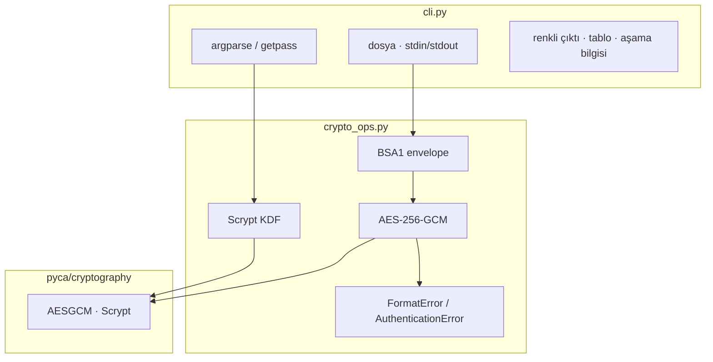
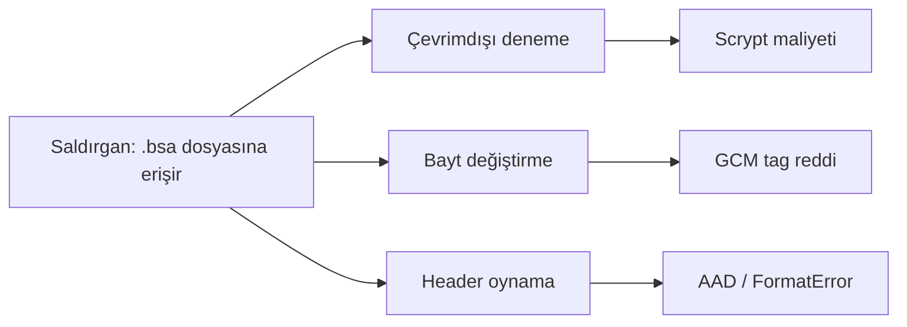
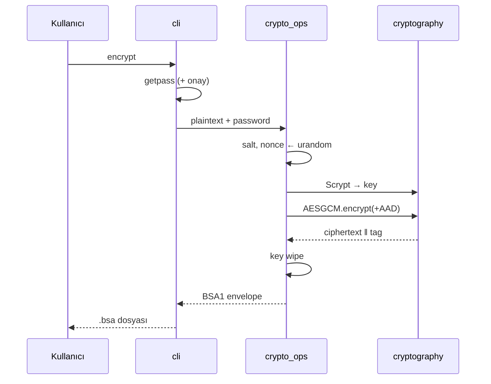

# Basit Şifreleme Aracı

[](https://github.com/beyzayilmaz1/basit_sifreleme_araci/actions/workflows/ci.yml)
[](https://www.python.org/downloads/)
[](./LICENSE)
[](./SECURITY.md)
[](https://cryptography.io/)

Dosya ve metin şifreleyen bir komut satırı aracı.

Bu proje, **Konsalt Staj Programı 2026 Bonus Havuzu** kapsamında geliştirilmiştir. Kendi şifreleme algoritması yazılmamış; `cryptography` kütüphanesinin standart bileşenleri kullanılmıştır.

- Teknik kararlar: **[report.md](./report.md)**
- Aşama aşama öğrenme: **[OGRENME_RAPORU.md](./OGRENME_RAPORU.md)**
- Konsalt güvenlik haritası: **[docs/konsalt-guvenlik-haritasi.md](./docs/konsalt-guvenlik-haritasi.md)**
- SIEM / Splunk köprüsü: **[docs/siem-mapping.md](./docs/siem-mapping.md)**
- Güvenlik politikası / CVD: **[SECURITY.md](./SECURITY.md)**

---

## Özellikler

| Komut | Açıklama |
|---|---|
| `encrypt` | Metin veya dosyayı parola / keyfile ile şifreler |
| `decrypt` | Şifreli paketi çözer |
| `inspect` | Paket metadata'sını tablo/JSON olarak gösterir (içeriği açmaz) |
| `verify` | Parola + bütünlüğü doğrular; plaintext yazmaz |
| `scan` | Hassas veri keşfi (Voltage discovery metaforu; PII maskeli) |
| `protect` | Keşif + şifreleme: bulgulu dosyaları `.bsa` yapar |
| `benchmark` | Scrypt + AES-GCM sürelerini ölçer |
| `self-check` | Kurulum ve güvenlik sözleşmelerini doğrular |
| `version` | Sürüm bilgisini yazar |

| Katman | Seçim |
|---|---|
| Şifreleme | AES-256-GCM |
| Anahtar türetme | Scrypt (`N=2^14`, `r=8`, `p=1`) |
| Rastgelelik | `os.urandom` (salt ve nonce) |

---

## Architecture Diagram



---

## Threat Model

| Varlık | Tehdit | Azaltma | Kapsam dışı |
|---|---|---|---|
| Düz metin dosyası | Disk/USB/yedek sızıntısı | AES-GCM şifreleme | OS bellek dökümü |
| Parola | Çevrimdışı kaba kuvvet | Scrypt + salt | Fiziksel tehdit / keylogger |
| Ciphertext | Manipülasyon | GCM tag + AAD | Yan kanal (timing detayı) |
| Format | Yanlış parser yorumu | Magic + version + AAD | Kasıtlı format forge (auth fail) |
| CLI kullanımı | `ps`/history sızıntısı | Varsayılan `getpass` | Zorla `--password` kullanımı |



---

## Security Design Decisions

1. **AES-GCM** — gizlilik + bütünlük tek AEAD arayüzünde
2. **Scrypt** — parola düşük entropili; bellek-sert KDF
3. **Taze salt + nonce** — her şifrelemede `os.urandom`
4. **AAD = MAGIC \|\| VERSION** — format kimliği ciphertext'e bağlı
5. **Genelleştirilmiş auth hatası** — “parola mı / tag mi?” ayrımı yok
6. **Anahtar wipe** — türetilen anahtar `bytearray` ile sıfırlanır
7. **Kendi algoritma yok** — yalnızca olgun primitives

Detay: [report.md § Güvenlik Tasarım Kararları](./report.md)

---

## Encryption Flow



---

## File Format

```text
┌────────┬─────────┬──────────┬───────────┬─────────────────────────┐
│ MAGIC  │ VERSION │   SALT   │   NONCE   │  CIPHERTEXT  ‖  TAG     │
│ 4 bayt │ 1 bayt  │ 16 bayt  │  12 bayt  │   N bayt     ‖ 16 bayt  │
└────────┴─────────┴──────────┴───────────┴─────────────────────────┘
  BSA1       0x01     random     random      AES-256-GCM çıktısı
```

- Uzantı önerisi: `.bsa`
- Aynı parola + aynı metin → **farklı** ciphertext (IND-CPA beklentisi)
- `inspect` içeriği açmadan header alanlarını listeler

---

## Kurulum

```powershell
cd basit_sifreleme_araci-main
python -m venv .venv
.\.venv\Scripts\Activate.ps1
pip install -r requirements.txt
$env:PYTHONPATH = (Get-Location).Path
```

Linux / macOS:

```bash
cd basit_sifreleme_araci-main
python -m venv .venv
source .venv/bin/activate
pip install -r requirements.txt
export PYTHONPATH="$(pwd)"
```

---

## Kullanım

### Metin / dosya şifreleme

```bash
python -m sifreleme_araci encrypt -t "gizli not" -o not.bsa
python -m sifreleme_araci encrypt -i ornekler/ornek.txt -o ornekler/ornek.txt.bsa
```

### Çözme / doğrulama / inceleme

```bash
python -m sifreleme_araci decrypt -i not.bsa
python -m sifreleme_araci decrypt -i not.bsa -o not.txt
python -m sifreleme_araci verify -i not.bsa
python -m sifreleme_araci inspect -i not.bsa
python -m sifreleme_araci inspect -i not.bsa --json
```

### Keşif / koruma (Voltage köprüsü)

```bash
python -m sifreleme_araci scan -i ornekler/hassas_ornek
python -m sifreleme_araci protect -i ornekler/hassas_ornek -o out --dry-run
python -m sifreleme_araci protect -i ornekler/hassas_ornek -o out --keyfile ornekler/vault.key.example
```

### Keyfile (Delinea / vault metaforu)

```bash
python -m sifreleme_araci encrypt -t "gizli" -o not.bsa --keyfile ornekler/vault.key.example
python -m sifreleme_araci verify -i not.bsa --keyfile ornekler/vault.key.example
```

### Audit log (Splunk / SIEM köprüsü)

```bash
python -m sifreleme_araci --audit-log audit.jsonl scan -i ornekler/hassas_ornek --summary
```

Ayrıntı: [docs/siem-mapping.md](./docs/siem-mapping.md)

### Sağlık, benchmark, sürüm


```bash
python -m sifreleme_araci self-check
python -m sifreleme_araci benchmark
python -m sifreleme_araci benchmark --sizes 1024,1048576 --rounds 5 --json
python -m sifreleme_araci version
```

### Canlı demo (sunum)

```bash
python ornekler/demo.py
```

`--password` yalnızca demo/test içindir; process listesinde görünür.

---

## Example Outputs

### `inspect` (tablo)

```text
BSA paket özeti
  Dosya        not.bsa
  Magic        BSA1
  Sürüm        1
  KDF          Scrypt(N=16384, r=8, p=1)
  Cipher       AES-256-GCM
  Salt         a1b2c3…
  Nonce        d4e5f6…
  Header       33 bayt
  Tag          16 bayt
  Ciphertext   25 bayt
  ≈ Plaintext  9 bayt
  Toplam       58 bayt
```

### `self-check`

```text
Self-check  sifreleme_araci 1.0.0
OK  round-trip + magic — şifrele/çöz
OK  wrong-password reject — AuthenticationError yolu
OK  format version — VERSION=1
OK  cryptography import — v46.x
OK  Tüm kontroller geçti.
```

### Yanlış parola

```text
Hata: Çözme başarısız. Parola yanlış veya veri bozulmuş olabilir.
```

---

## Benchmark

Küçük dosyalarda süre çoğunlukla **Scrypt** kaynaklıdır; AES-GCM maliyeti ikincildir.

```bash
python -m sifreleme_araci benchmark --sizes 0,1024,65536,1048576 --rounds 3
```

Örnek (makineye göre değişir):

| Boyut | Encrypt (ms) | Decrypt (ms) | Not |
|---|---|---|---|
| 0 B | ~70–150 | ~70–150 | Neredeyse saf KDF |
| 1 KiB | ~70–150 | ~70–150 | KDF baskın |
| 1 MiB | KDF + şifreleme | KDF + çözme | Boyut etkisi görünür |

---

## Project Structure

```text
basit_sifreleme_araci-main/
├── README.md
├── report.md                 # teknik karar / threat model
├── OGRENME_RAPORU.md         # aşama aşama: ekledim / öğrendim
├── requirements.txt
├── ruff.toml
├── docs/
│   ├── konsalt-guvenlik-haritasi.md
│   └── siem-mapping.md
├── .github/
│   ├── workflows/ci.yml      # lint + test (Win/Linux)
│   ├── workflows/release.yml # tag → GitHub Release
│   ├── ISSUE_TEMPLATE/
│   ├── PULL_REQUEST_TEMPLATE.md
│   └── CODEOWNERS
├── sifreleme_araci/
│   ├── __main__.py
│   ├── cli.py                # UX, argparse, scan/protect, audit
│   ├── crypto_ops.py         # Scrypt, AES-GCM, format
│   ├── discovery.py          # hassas veri keşfi
│   └── secrets_io.py         # keyfile / secret kaynağı
├── ornekler/
│   ├── ornek.txt
│   ├── demo.py
│   ├── vault.key.example
│   └── hassas_ornek/         # sentetik PII örnekleri
└── tests/
    ├── test_crypto.py
    └── test_discovery_protect.py
```

---

## Test

```bash
python -m unittest discover -s tests -v
python -m sifreleme_araci self-check
```

Kapsanan senaryolar: round-trip (metin/boş/binary/unicode/1MiB), yanlış parola, tag/salt bozma, rastgele bayt bozma, geçersiz magic/sürüm/kısa paket, verify, CLI smoke, benchmark.

---

## FAQ

**Neden kendi algoritma yok?**  
Güvenlik, kamu incelemesine açık standartlardan gelir. “Ben kıramadım” kanıt değildir. Görev de bunu ister; bkz. `report.md`.

**Neden AES-GCM, CBC değil?**  
CBC tek başına bütünlük sağlamaz. GCM AEAD’dir; tag doğrulanmadan plaintext dönmez.

**Neden Scrypt, PBKDF2 değil?**  
Scrypt bellek-serttir; GPU/ASIC kaba kuvvetini pahalılaştırır. Argon2id modern alternatiftir; bu kapsamda Scrypt kütüphane uyumuyla seçildi.

**Parolayı unuttum — kurtarabilir miyim?**  
Hayır. Bu bilinçli bir tasarımdır; backdoor yoktur.

**`inspect` içeriği okur mu?**  
Hayır. Yalnızca header metadata’sını parse eder.

**Büyük dosyalar?**  
Tüm dosya belleğe alınır. Çok büyük arşivler için akışlı (chunked) format gelecekte değerlendirilebilir.

**Renkleri kapatmak?**  
`NO_COLOR=1` ortam değişkeni.

---

## Sınırlar

Bu araç öğrenme ve kişisel kullanım içindir. Kurumsal KMS/HSM vaat etmez.

Konsalt güvenlik köprüsü için eklenenler: [`SECURITY.md`](./SECURITY.md) (CVD), Bandit + pip-audit CI, atomik/`0o600` yazma, `BSA_MAX_BYTES`, secrets’siz audit log, `scan`/`protect`, `--keyfile`, SIEM mapping — bkz. [`OGRENME_RAPORU.md`](./OGRENME_RAPORU.md).

| Sınır | Açıklama |
|---|---|
| Parola gücü | Zayıf parola, KDF olsa da zayıf kalır |
| Bellek | Çözülmüş veri RAM’de düz halde durur |
| Anahtar yönetimi | KMS/HSM yok; parola = anahtar kaynağı |
| Operasyon | Dosya izinleri ve yedekleme kullanıcıya ait |

---

## Kaynaklar

- [pyca/cryptography](https://cryptography.io/)
- [NIST SP 800-38D](https://csrc.nist.gov/publications/detail/sp/800-38d/final) (GCM)
- [RFC 7914](https://www.rfc-editor.org/rfc/rfc7914) (scrypt)
- Konsalt Staj Programı 2026 — Bonus Havuzu
