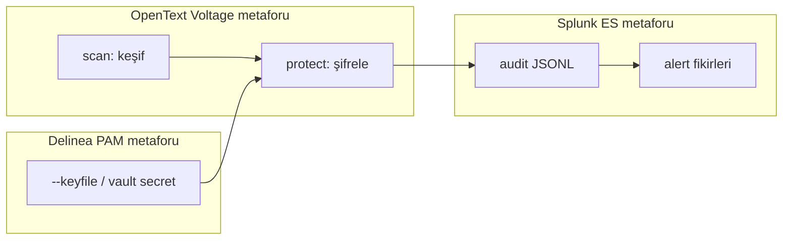

# Konsalt Güvenlik Portföyü — Öğrenme Haritası

Kaynak: [Güvenlik Çözümleri](https://www.konsalt.com.tr/cozumlerimiz/guvenlik-cozumleri/)

Bu proje Voltage / Delinea / Splunk **değildir**. Amaç, üç ürünün
birlikte çözdüğü problemi küçük parçalara ayırıp CLI üzerinde öğrenmektir.

| Konsalt ürünü | Kurumsal iş | Bu projedeki karşılık | Bilinçli sınır |
|---|---|---|---|
| OpenText Voltage | Veri keşfi + şifreleme + erişim | `scan`, `protect`, AES-GCM | KMS/erişim politikası yok |
| Delinea | Ayrıcalıklı hesap / vault / oturum | `--keyfile` | PAM, session record yok |
| Splunk ES | SIEM korelasyon / SOC | `--audit-log` + `docs/siem-mapping.md` | Gerçek Splunk yok |

## Bu haritanın amacı

Bu doküman, bonus/staj kapsamında **öğrenme** için yazıldı.
Voltage / Delinea / Splunk ürünlerini taklit etmek değil; üç ürünün
çözdüğü problemi parçalara ayırıp kendi CLI’mda küçük karşılıklar kurarak
anlamaktır.
