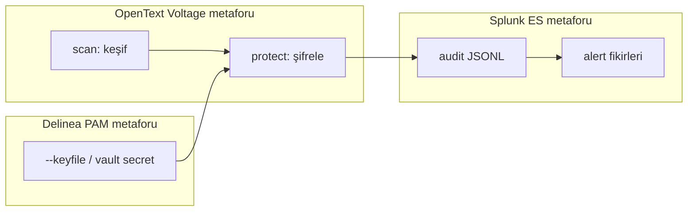

# Konsalt Güvenlik Portföyü — Öğrenme Haritası

**Kaynak:** [Güvenlik Çözümleri](https://www.konsalt.com.tr/cozumlerimiz/guvenlik-cozumleri/)  
**İlgili:** [`OGRENME_RAPORU.md`](../OGRENME_RAPORU.md), [`report.md`](../report.md) §10

Bu proje OpenText Voltage, Delinea veya Splunk ES **değildir**. Amaç, üç ürünün birlikte çözdüğü güvenlik sorumluluklarını küçük parçalara ayırıp CLI üzerinde doğrulanabilir biçimde öğrenmektir.

| Konsalt ürünü | Kurumsal iş | Bu projedeki karşılık | Bilinçli sınır |
|---|---|---|---|
| OpenText Voltage | Veri keşfi + şifreleme + erişim | `scan`, `protect`, AES-GCM | KMS / erişim politikası yok |
| Delinea | Ayrıcalıklı hesap / vault / oturum | `--keyfile` | PAM, session record, onay akışı yok |
| Splunk ES | SIEM korelasyon / SOC | `--audit-log` + [`siem-mapping.md`](./siem-mapping.md) | Gerçek Splunk entegrasyonu yok |

## Bu haritanın amacı

Belge, bonus / staj kapsamında **öğrenme** için yazılmıştır. Ürün taklidi değil; üç ürünün çözdüğü problemi parçalara ayırıp kendi CLI üzerinde küçük, test edilebilir karşılıklar kurarak anlamaktır.
