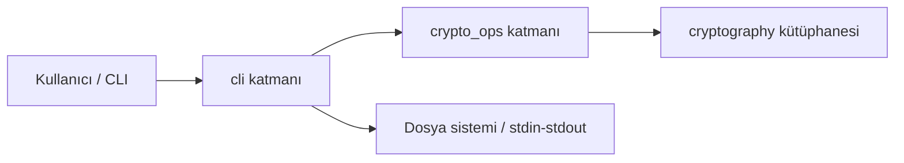
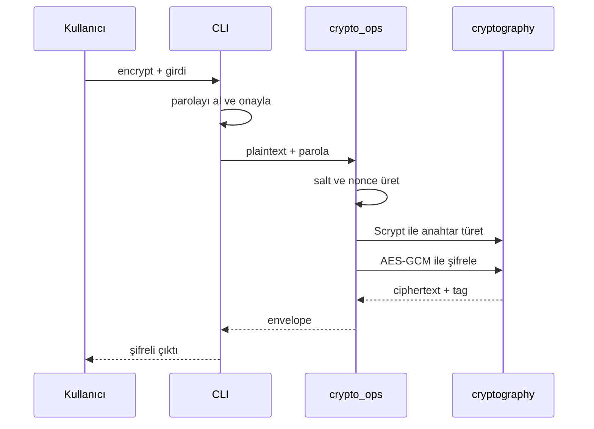
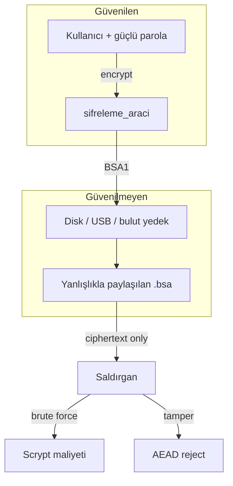

# Basit Şifreleme Aracı — Teknik Tasarım Raporu

**Proje:** Dosya ve metin şifreleyen komut satırı aracı  
**Bağlam:** Konsalt Staj Programı 2026 — Bonus Havuzu  
**Doküman türü:** Teknik karar ve güvenlik tasarımı raporu  
**Hedef okuyucu:** Teknik bilgisi olan yazılım yöneticisi  

---

## 1. Giriş

### 1.1 Projenin amacı

Bu projenin amacı, kullanıcının verdiği metni veya dosyayı parola ile şifreleyip çözebilen bir komut satırı aracı üretmektir. Hedef yalnızca “çalışan bir program” yazmak değildir. Hedef; hazır ve incelenmiş bir kriptografi kütüphanesi kullanarak, güvenli yazılım geliştirme prensiplerine uygun ve gerekçelendirilebilir teknik kararlar almaktır.

Görev tanımındaki kritik kısıt açıktır: kendi şifreleme algoritması yazılmayacaktır. Bu kısıt, işi bir uygulama egzersizinden çıkarıp mühendislik kararı problemine dönüştürür. Soru “şifrelemeyi nasıl icat ederim?” değil; “hangi standart bileşenleri, hangi tehdit modeline göre, neden böyle birleştiririm?” sorusudur.

### 1.2 Çözmek istediği problem

Disk üzerinde düz metin duran bir dosya veya not, dosyaya erişebilen herkes tarafından okunabilir. İşletim sistemi parolası veya klasör izni, yedekleme, USB kaybı, yanlış paylaşılan klasör veya taşınabilir disk gibi senaryolarda içeriği her zaman korumaz.

Bu araç, içeriği parola bilinmeden anlamlı hale gelmeyecek bir şifreli paket formatına dönüştürerek bu riski azaltmayı hedefler.

### 1.3 Proje kapsamı

**Kapsam içinde:** metin/dosya şifreleme ve çözme, parola tabanlı anahtar türetme, authenticated encryption, sürümlenebilir dosya formatı, temel hata yönetimi, birim testler ve kararların belgelenmesi.

**Kapsam dışında:** KMS/HSM, ağ üzerinden anahtar dağıtımı, çok kullanıcılı erişim kontrolü, secure enclave, anti-forensic özellikler ve grafik arayüz.

Bu sınırlar, aracın öğrenme ve kişisel kullanım CLI’si olduğunu netleştirmek içindir. Ürün vaadi abartılmamıştır.

---

## 2. Problem Analizi

### 2.1 Dosya neden şifrelenmelidir?

Erişim kontrolü “kim dosyayı açabilir?” sorusuna cevap verir. Şifreleme ise “dosyayı ele geçiren kişi içeriği okuyabilir mi?” sorusuna cevap verir. Bu iki katman birbirinin yerine geçmez.

Dizüstü hırsızlığı, yanlış bulut yüklemesi veya kaybolan USB gibi durumlarda dosya sistemi izinleri çoğu zaman yeterli değildir. Şifreleme, veri durağan haldeyken (data at rest) ek bir koruma katmanı sağlar.

### 2.2 Sadece parola koymak neden yeterli değildir?

Uygulama seviyesinde “parola sor” demek çoğu zaman yalnızca bir erişim kapısıdır. Parola doğrulandıktan sonra içerik diskte düz halde kalıyorsa, saldırganın hedefi kapıyı aşmak değil; erişebildiği depolamayı okumak olabilir. Base64, basit XOR veya benzeri gizleme yöntemleri güvenlik illüzyonu yaratır; kriptografik koruma sağlamaz.

Bu nedenle parola, UI kontrolü olmaktan çıkıp şifreleme anahtarını türeten girdiye dönüştürülmelidir. Parola doğru bilinmeden içerik geri üretilmemelidir.

### 2.3 Kriptografi neden gereklidir?

Kriptografi burada iki ihtiyacı birlikte ele alır:

1. **Gizlilik:** Yetkisiz taraf ciphertext’ten plaintext üretememelidir.
2. **Bütünlük:** Yetkisiz taraf ciphertext’i değiştirip uygulamanın bunu fark etmeden kabul etmemelidir.

Yalnızca gizlilik sağlayan tasarımlar, oynanmış ciphertext’in sessizce “çözülmesine” izin verebilir. Bu nedenle projede authenticated encryption araştırılmış ve tercih edilmiştir.

---

## 3. Yapılan Ön Araştırmalar

Her başlık aynı akışı izler: problem → araştırma → alternatifler → karar → gerekçe.

### 3.1 Simetrik mi, asimetrik mi?

**Problem:** Kullanıcı kendi dosyasını kendisi şifreleyip çözecektir; üçüncü tarafa anahtar dağıtımı zorunlu değildir.

**Araştırma:** Simetrik şifrelemede aynı anahtar hem şifreler hem çözer. Asimetrik sistemler (RSA/ECC) özellikle taraflar arası güvenli anahtar paylaşımında değerlidir.

| Yaklaşım | Avantaj | Dezavantaj |
|---|---|---|
| Simetrik | Hızlı, dosya şifrelemede yaygın, tek kullanıcıya uygun | Anahtar/parola yönetimi kullanıcıya kalır |
| Asimetrik ile doğrudan dosya | Anahtar dağıtımı senaryolarında güçlü | Büyük dosyada yavaş; bu CLI için fazla karmaşık |
| Hibrit | Gerçek sistemlerde yaygın doğru model | Bu tehdit modelinde gereksiz mühendislik |

**Karar:** Simetrik şifreleme.

**Gerekçe:** Problem tek kullanıcılıdır. Asimetrik katman güvenlikten çok operasyonel karmaşıklık getirirdi. Gerçek projelerde büyük veri genelde simetrik şifrelenir; asimetrik katman çoğunlukla anahtar sarma veya kimlik doğrulama içindir.

### 3.2 Neden AES?

**Problem:** Hangi simetrik algoritma seçilmeli?

**Araştırma:** AES uzun süredir standartlaşmış, donanım hızlandırması ve geniş kütüphane desteği olan bir algoritmadır. ChaCha20 güçlü bir alternatiftir; özellikle bazı yazılım-only ortamlarda tercih edilir.

| Seçenek | Avantaj | Dezavantaj |
|---|---|---|
| AES-256 | Endüstri standardı, net referans noktası | Mod yanlış seçilirse güvenlik zayıflar |
| ChaCha20 | Modern ve yazılımda genelde hızlı | Bu görevde AES kadar ortak beklenti taşımıyor olabilir |
| Özel/eski şifreler | Öğrenme hissi verir | Üretim güvenliği için uygun değil |

**Karar:** AES-256.

**Gerekçe:** Junior seviyede savunulabilir yol, “en yeni algoritma” yarışı değil; doğru mod ile kullanılan yerleşik standarttır. Kütüphane desteği olgun, performans dosya şifreleme için yeterlidir.

### 3.3 AES-CBC neden kullanılmadı?

**Problem:** AES tek başına yeterli midir, yoksa çalışma modu da kritik midir?

**Araştırma:** CBC gizlilik sağlayabilir; tek başına bütünlük sağlamaz. Uygun MAC olmadan ciphertext üzerinde yapılan bazı değişiklikler fark edilmeden plaintext’i bozabilir. Padding hataları da yanlış tasarlanırsa bilgi sızıntısına yol açabilir.

**Alternatifler:** CBC + ayrı HMAC, CTR + ayrı MAC, AEAD modları.

**Karar:** MAC’siz CBC kullanılmadı.

**Gerekçe:** “Dosya değişmişse fark edilsin” ihtiyacı vardır. CBC doğru kullanılabilir; ancak birleştirme hatasına daha açıktır. Daha az hata payı olan AEAD tercih edildi.

CBC seçilseydi oluşabilecek problemler: sessiz manipülasyon, bütünlük katmanının unutulması, hata mesajlarından istemeden bilgi sızması.

### 3.4 AES-GCM neden seçildi?

**Problem:** Gizlilik ve bütünlük tek ve tutarlı arayüzle nasıl sağlanır?

**Araştırma:** GCM bir AEAD modudur. Doğrulama etiketi üretir; etiket doğrulanmazsa plaintext dönmez. Ayrıca AAD ile şifrelenmeyen ama doğrulanan veri bağlanabilir.

| Seçenek | Avantaj | Dezavantaj |
|---|---|---|
| AES-GCM | AEAD, yaygın, AAD desteği | Nonce yönetimi kritik; reuse tehlikeli |
| ChaCha20-Poly1305 | Güçlü AEAD alternatif | Bu projede AES kadar doğrudan eşleşme yok |
| Fernet | Yüksek seviye recipe, kullanımı kolay | İç kararlar daha az görünür |

**Karar:** AES-256-GCM.

**Gerekçe:** İhtiyacı doğrudan karşılar. Fernet de kurala uygun olurdu; burada amaç “Fernet’ten daha güvenli olmak” değil, nonce/AAD/tag kararlarını açıklanabilir kılmaktır.

GCM seçilmeseydi risk artardı: bütünlüğün unutulması veya iki mekanizmanın yanlış birleştirilmesi.

### 3.5 cryptography kütüphanesi neden tercih edildi?

**Problem:** Python’da işlem hangi bağımlılıkla yapılmalı?

**Araştırma:** Görev açıkça `cryptography` kütüphanesini işaret eder. PyCryptodome veya doğrudan OpenSSL sarmalayıcıları alternatif olabilir; görev kısıtı ve ekosistem olgunluğu `cryptography` lehinedir.

**Karar:** `cryptography` üzerinden AESGCM + Scrypt.

**Gerekçe:** Görev uyumu, aktif bakım, belgelenmiş API ve kendi low-level implementasyon riskini ortadan kaldırma. Gerçek projelerde de ekipler incelenmiş kütüphaneleri tercih eder; çünkü açıklar yalnızca algoritma seçiminden değil, implementasyon hatalarından da doğar.

### 3.6 Neden kendi algoritma yazılmadı?

**Problem:** “Basit XOR + hash yeterli olmaz mı?” sorusu öğrenme sürecinde cazip görünür.

**Araştırma:** Güvenli sistem; rastgelelik, KDF, nonce, bütünlük, hata işleme ve kullanım disiplinini birlikte gerektirir. “Ben kıramadım” güvenlik kanıtı değildir. Standartlar uzun süre kamu incelemesine tabidir.

**Karar:** Özel şifreleme, MAC veya KDF tasarlanmadı.

**Gerekçe:** Görev kuralı bunu ister; araştırma da kuralın mühendislik sebebini doğrular. Kendi algoritma yazmak inceleme maliyeti taşımayan tasarım üretir, bilinen saldırı sınıflarını yeniden keşfetme riski yaratır ve güvenlik hissi verip zayıf koruma sunabilir.

### 3.7 Paroladan anahtar nasıl türetilmeli?

**Problem:** Kullanıcı parolası doğrudan AES anahtarı yapılabilir mi?

**Araştırma:** İnsan parolaları düşük entropilidir. Hızlı özetler kaba kuvveti ucuzlatır. PBKDF2, Scrypt ve Argon2 gibi KDF’ler bilerek maliyetli çalışır. Salt, aynı parolanın her yerde aynı anahtarı üretmesini engeller.

| KDF | Avantaj | Dezavantaj |
|---|---|---|
| PBKDF2 | Yaygın ve anlaşılır | Bellek-sert değil |
| Scrypt | Bellek-sert, kütüphanede hazır | Parametre dengesi ister |
| Argon2id | Modern güçlü tercih | Bu kapsamda ek API/tercih maliyeti |

**Karar:** Scrypt (`N=2^14`, `r=8`, `p=1`) + 16 bayt salt.

**Gerekçe:** Interaktif CLI için kabul edilebilir gecikme ile deneme maliyetini yükseltir. Argon2 birçok yeni sistemde tercih edilir; burada seçim “Argon2 kötüdür” değil, kütüphane uyumu ve kapsam sadeliği kararadır.

---

## 4. Yazılım Mimarisi

Mimari bilerek ince tutuldu. Amaç enterprise klasör şişirmek değil; güvenlik çekirdeğini arayüzden ayırmaktır.

### 4.1 `cli` katmanı

**Görevi:** Argümanları işlemek, parolayı almak, giriş/çıkışı yönetmek, kullanıcıya durum bildirmek.

**Neden ayrı?** argparse, getpass ve path detayları şifreleme mantığına karışmamalıdır. Karışırsa test zorlaşır; güvenlik kuralları UI içine gömülür.

**Sürdürülebilirlik:** Aynı çekirdek ileride başka bir arayüzle de kullanılabilir.

### 4.2 `crypto_ops` katmanı

**Görevi:** Anahtar türetme, şifreleme/çözme, paket formatı, güvenli hata üretimi.

**Neden ayrı?** Kriptografik kararlar tek yerde toplanır; denetim ve test yüzeyi netleşir.

**Sürdürülebilirlik:** Format sürümü değişirse değişiklik alanı sınırlı kalır.

### 4.3 Test katmanı

**Görevi:** Round-trip ve negatif güvenlik senaryolarını otomatik doğrulamak.

**Neden ayrı?** Bütünlük ihlali gibi durumlar yalnızca mutlu yol denemesiyle yakalanmaz.

---

## 5. Şifreleme Süreci

Kullanıcıya basit görünen akış, arka planda zorunlu güvenlik adımlarını içerir.

### 5.1 Şifreleme adımları

1. Metin veya dosya alınır.
2. Parola interaktif alınır; şifrelemede bir kez daha onaylanır.
3. Rastgele salt üretilir.
4. Scrypt ile 256-bit anahtar türetilir.
5. Yeni nonce üretilir.
6. AES-GCM plaintext’i şifreler; format kimliği AAD olarak bağlanır.
7. Envelope birleştirilir: kimlik, sürüm, salt, nonce, ciphertext ve tag.
8. Sonuç dosyaya veya çıktı kanalına yazılır.

### 5.2 Çözme adımları

1. Envelope okunur.
2. Kimlik ve sürüm kontrol edilir.
3. Salt ve nonce ayrıştırılır.
4. Aynı parametrelerle anahtar yeniden türetilir.
5. AES-GCM doğrulama yapar.
6. Başarısızsa plaintext dönülmez; genel hata verilir.
7. Başarılıysa düz veri yazılır.

Güvenlik, yalnızca sonunda AES çağrıldığı için oluşmaz. Salt, KDF, nonce, AEAD ve format kontrollerinin birlikte çalışmasıyla oluşur.

---

## 6. Güvenlik Tasarım Kararları

Her önlem aynı zincirle anlatılmıştır.

### 6.1 Salt

**Problem:** Aynı parola her dosyada aynı anahtarı üretirse saldırı yüzeyi büyür.  
**Risk:** Ortak anahtar ve önceden hesaplanmış saldırılar kolaylaşır.  
**Çözüm:** Her şifrelemede yeni rastgele salt.  
**Uygulama:** Salt paket içinde açık saklanır; gizlilik için değil, tekilleştirme için vardır.  
**Avantaj:** Aynı parola farklı dosyalarda farklı anahtar üretir.

### 6.2 Nonce

**Problem:** GCM, aynı anahtar altında nonce tekrarını tolere etmez.  
**Risk:** Nonce reuse güvenlik varsayımını bozar.  
**Çözüm:** Her işlemde yeni 12 baytlık rastgele nonce.  
**Uygulama:** Nonce paketle birlikte taşınır.  
**Avantaj:** Tek kullanımlık değer disiplini korunur; sayaç senkronu gerekmez.

### 6.3 Authentication tag

**Problem:** Yalnızca gizlilik değiştirmeyi tespit etmez.  
**Risk:** Oynanmış ciphertext uygulama tarafından kabul edilebilir.  
**Çözüm:** GCM tag ile authenticated decryption.  
**Uygulama:** Tag doğrulanmadan içerik verilmez.  
**Avantaj:** Bozuk veya manipüle paket fail-closed davranır.

### 6.4 Scrypt

**Problem:** İnsan parolası zayıf olabilir.  
**Risk:** Hızlı hash ile çevrimdışı kaba kuvvet ucuzlar.  
**Çözüm:** Bellek-sert ve maliyetli KDF.  
**Uygulama:** Sabit Scrypt parametreleriyle türetme.  
**Avantaj:** Her deneme daha pahalı hale gelir; mucize değil, maliyet artırımıdır.

### 6.5 AES-GCM

**Problem:** Gizlilik ve bütünlük ayrı kurulursa birleştirme hatası riski artar.  
**Risk:** MAC unutma veya yanlış sıra.  
**Çözüm:** AEAD olarak GCM.  
**Uygulama:** Tek primitive üzerinden şifreleme + doğrulama.  
**Avantaj:** Daha az hareketli parça, daha net tehdit modeli.

### 6.6 Dosya formatı

**Problem:** Ham bayt yığını sürüm değişiminde yanlış yorumlanabilir.  
**Risk:** Parser karışıklığı ve sessiz uyumsuzluk.  
**Çözüm:** Magic + version + salt + nonce + ciphertext/tag; AAD ile format bağlama.  
**Uygulama:** Tanınmayan format reddedilir; `inspect` gizli veriyi açmadan metadata gösterir.  
**Avantaj:** Paket taşınabilir, denetlenebilir ve sürümlenebilir olur.

### 6.7 Hata yönetimi

**Problem:** Aşırı detaylı hata mesajları yol gösterebilir.  
**Risk:** “Parola yanlış” ile “tag bozuk” ayrımı bilgi sızdırabilir.  
**Çözüm:** Çözme başarısızlıklarında genelleştirilmiş mesaj; format hataları ayrı sınıf.  
**Uygulama:** `AuthenticationError` tek mesaj; `FormatError` magic/sürüm/uzunluk için.  
**Avantaj:** Kullanıcı yönlendirilir; saldırgana auth ayrımı mümkün olduğunca verilmez.

### 6.8 Parola alma yöntemi

**Problem:** Komut satırı argümanındaki parola process listesi ve history’de görünebilir.  
**Risk:** Yerel gözlem veya loglar parolayı ele geçirebilir.  
**Çözüm:** Varsayılan interaktif gizli giriş; demo bayrağı varsa uyarı.  
**Uygulama:** Gerçek yol getpass; test kolaylığı bilinçli risk olarak işaretlenir.  
**Avantaj:** Varsayılan yol daha güvenli tutulur.

### 6.9 Anahtar bellek temizliği

**Problem:** Türetilen AES anahtarı işlem sonrası bellekte kalabilir.  
**Risk:** Bellek dökümü / swap senaryolarında anahtar artığı.  
**Çözüm:** Anahtarı `bytearray` olarak tutup `finally` içinde sıfırlamak.  
**Uygulama:** `encrypt_bytes` / `decrypt_bytes` sonunda `_wipe(key)`.  
**Avantaj:** Python’da `str` parola güvenli silinemez; en azından anahtar materyali minimize edilir.  
**Sınır:** Tam anti-forensic garanti değildir (GC, kopyalar, takas).

---

## 7. Hata Senaryoları

### 7.1 Boş parola

Boş girdi ile işlem başlatılabilir. Anahtar türetmeden önce reddedilir. Mesaj nettir; çünkü problem kullanım hatasıdır. Böylece “şifrelenmiş gibi görünen” anlamsız güvenlik hissi üretilmez.

### 7.2 Yanlış parola

Kullanıcı parolayı yanlış yazabilir. GCM doğrulaması başarısız olur. Mesaj “yanlış parola veya bozulmuş veri” şeklinde genellenir. Amaç, hangi kontrolün fail ettiğine dair ince ayrım vermemektir.

### 7.3 Bozulmuş veya oynanmış dosya

Disk hatası, eksik kopya veya kasıtlı manipülasyon olabilir. Tag veya format kontrolü fail eder. Kullanıcıya jargon yerine anlaşılır başarısızlık gösterilir. Şüpheli içerik düz veri gibi sunulmaz.

### 7.4 Geçersiz format / kısa paket

Yanlış dosya veya kesilmiş çıktı seçilebilir. Magic, uzunluk ve sürüm kontrolleri erken reddeder. Böylece rastgele bayt dizileri kontrolsüz işlenmez.

### 7.5 Eksik girdi argümanları

CLI yanlış kullanımında işlem belirsiz kalabilir. Argüman ve stdin kontrolleri bunu ayırır. Amaç, kullanım hatasını güvenlik hatasından ayırmaktır.

### 7.6 Parola onayı uyuşmazlığı

Şifrelemede iki kez girilen parola farklı olabilir. İşlem iptal edilir. Böylece yanlış parola ile erişilemez arşiv oluşturma riski azaltılır.

---

## 8. Test Süreci

Testler “kod çalışıyor mu?”dan çok “hangi güvenlik varsayımı kırılırsa fark ederiz?” sorusuna cevap vermek için yazıldı.

| Test odağı | Neden yazıldı? | Azalttığı risk |
|---|---|---|
| Round-trip (metin/boş/binary) | Temel sözleşmeyi kilitlemek | Sessiz veri kaybı, encoding ve kenar durum kaçakları |
| Aynı girdinin farklı ciphertext üretmesi | Salt/nonce tazeliğini doğrulamak | GCM için kritik olan değer tekrarının gizlenmesi |
| Yanlış parola | Negatif yolu kilitlemek | Doğrulamanın atlanması veya hatanın yutulması |
| Ciphertext bozma | Bütünlüğün fiilen çalıştığını göstermek | Manipülasyonun sessiz kabulü |
| Başlık / AAD bağlama | Format alanlarının kopuk kalmaması | Yanlış sürümle sessiz yorumlama |
| Magic / kısa paket | Parser dayanıklılığı | Belirsiz girdide öngörülemeyen davranış |
| Metadata inspect | İnceleme yolunun sınırını korumak | Debug sırasında gizli içeriğin açılması |

Bu set kapsamlı sızma testi değildir. Tasarımın dayandığı birkaç güvenlik sözleşmesini otomatik kilitler.

---

## 9. Güvenlik Değerlendirmesi

### 9.1 Güçlü yönler

- Kendi algoritma icat edilmemiştir.
- AEAD ile gizlilik ve bütünlük birlikte ele alınmıştır.
- Parola doğrudan anahtar yapılmamış, Scrypt kullanılmıştır.
- Her işlemde taze salt ve nonce vardır.
- Format sürümlenmiş ve temel bağlar düşünülmüştür.
- Çözme hataları genelleştirilmiştir.
- Negatif senaryolar için otomatik testler vardır.
- Sınırlar abartılmadan yazılmıştır.

### 9.2 Sınırlamalar

- Güvenlik parola gücüne bağlıdır.
- Çözülmüş veri bellekte düz halde bulunur.
- Anahtar yönetimi yoktur; parola unutulursa veri pratikte kurtarılamaz.
- İleri düzey yan kanal saldırıları kapsam dışıdır.
- Bağımlılık tedarik zinciri riski operasyoneldir.

### 9.3 Bilinçli olarak yapılmayan özellikler

KMS entegrasyonu, anahtar dosyası modeli, sıkıştırma+şifreleme, çoklu alıcı için public-key sarma, donanım token desteği ve iddialı güvenlik etiketleri bilinçli olarak eklenmedi. Her ekstra özellik yeni tehdit yüzeyi açar; kapsam dar tutuldu.

### 9.4 Gelecekte geliştirilebilecek noktalar

Argon2id araştırması, KDF maliyetini kullanım profiline göre ayarlama, büyük dosya bellek/akış ölçümü, bağımlılık güncelleme pratikleri, fuzzing ve kurumsal ihtiyaçta KMS ile anahtar sarma değerlendirilebilir. Özellik eklemek otomatik olarak daha güvenli demek değildir; önce tehdit modeli güncellenmelidir.

**v1.3 notu:** Konsalt güvenlik portföyüne öğrenme köprüleri eklendi (`scan`/`protect`, `--keyfile`, SIEM mapping). Ayrıntı: `OGRENME_RAPORU.md`.

---

## 11. Threat Model (STRIDE özeti)

Bu bölüm, aracın **ne koruduğunu** ve **neyi vaat etmediğini** netleştirir.

| Varlık | Saldırgan yeteneği | Risk | Kontrol | Kapsam dışı |
|---|---|---|---|---|
| Plaintext (diskte) | Dosyayı okuyabilen yerel/uzak aktör | Yüksek | AES-GCM şifreleme | Çalışma anı bellek dökümü |
| Parola | Çevrimdışı sözlük / kaba kuvvet | Yüksek (zayıf parolada) | Scrypt + unique salt | Keylogger, shoulder surfing |
| `.bsa` paketi | Bayt değiştirme / kesme | Orta | GCM tag, uzunluk, magic/version | İnkâr edilemezlik (non-repudiation) |
| Header alanları | Salt/nonce/version oynama | Orta | Auth fail veya FormatError; AAD | Header’ın gizliliği (gerekmez) |
| CLI süreci | `ps`, shell history | Orta | Varsayılan getpass; `--password` uyarısı | Zorla güvensiz kullanım |
| Kütüphane | Tedarik zinciri | Düşük–orta | Bilinen paket, sürüm sabitleme önerisi | Tam SBOM / imza doğrulama |

**Güven sınırı:** Saldırganın `.bsa` dosyasına ve (isteğe bağlı) zayıf parolaya erişimi vardır; güvenli bir HSM veya OS zorunlu değildir. Araç “data at rest” için kişisel şifreleme sunar; güvenli mesajlaşma veya çok kullanıcılı ACL değildir.

---

## 12. Trade-offs

| Karar | Kazanım | Bedel |
|---|---|---|
| Tüm dosyayı belleğe almak | Basit, doğru AEAD kullanımı | Çok büyük dosyalarda RAM baskısı |
| Scrypt N=2^14 | Interaktif CLI’da kabul edilebilir gecikme | Yüksek güvenlik profilinde “daha pahalı” olabilir |
| Sabit KDF parametreleri | Format sade, öngörülebilir | Dosya başına parametre esnekliği yok |
| Genelleştirilmiş auth hatası | Oracle daraltma | Kullanıcı “parola mı bozuk dosya mı?” ayırt edemez |
| Simetrik + parola | Basit UX | Anahtar kurtarma / paylaşım yok |
| Fernet yerine açık primitives | Öğrenme ve gerekçelendirme | Daha fazla birleştirme sorumluluğu |
| Ek CLI komutları (verify/benchmark) | Sunum ve operasyonel güven | Bakım yüzeyi biraz artar |

---

## 13. Alternative Algorithms

| Aile | Aday | Bu projede neden seçilmedi / neden alternatif? |
|---|---|---|
| AEAD | ChaCha20-Poly1305 | Güçlü; yazılım-only CPU’larda sık tercih. AES donanım hızlandırması yaygın olduğu için AES-GCM seçildi. |
| AEAD | AES-CCM | AEAD; GCM kadar yaygın CLI örneği değil. |
| Mod + MAC | AES-CTR + HMAC | Doğru kurulursa güvenli; birleştirme hatası riski yüksek. |
| Recipe | Fernet | Görev için geçerli olurdu; nonce/AAD/tag kararları daha az görünür. |
| KDF | PBKDF2 | Yaygın ama bellek-sert değil. |
| KDF | Argon2id | Birçok yeni sistemde birincil tercih; `cryptography` ile kullanılabilir — gelecekte migrasyon adayı. |
| Asimetrik | RSA/Age hibrit | Tek kullanıcılı “kendime şifrele” modelinde gereksiz karmaşıklık. |

---

## 14. Why AES-GCM

1. **AEAD:** Gizlilik ve bütünlük tek primitive.
2. **AAD:** Format kimliğini (`MAGIC||VERSION`) ciphertext’e bağlama imkânı.
3. **Fail-closed:** Tag doğrulanmadan plaintext yok.
4. **Ekosistem:** NIST SP 800-38D, geniş kütüphane ve donanım desteği.
5. **Öğretilebilirlik:** Junior sunumunda “neden CBC değil?” sorusuna net cevap.

**Kritik disiplin:** Aynı anahtar altında nonce tekrarı olmamalı. Bu araç her işlemde 96-bit rastgele nonce üretir; sayaç senkronu gerektirmez. Yüksek hacimli sunucu senaryosunda rastgele nonce çarpışma riski ayrıca analiz edilir; kişisel CLI için kabul edilebilir.

---

## 15. Why Scrypt

1. İnsan parolaları düşük entropilidir; hızlı hash kaba kuvveti ucuzlatır.
2. Scrypt **bellek-serttir** (RFC 7914); yalnızca CPU döngüsü değil, RAM de ister.
3. `cryptography` içinde hazır ve bakımlıdır.
4. Parametreler (`N=2^14`, `r=8`, `p=1`) interaktif kullanım ile deneme maliyeti arasında bilinçli dengedir.
5. Salt (16 bayt) aynı parolanın her dosyada aynı anahtarı üretmesini engeller.

**Argon2id notu:** Birçok rehber (OWASP) yeni tasarımlarda Argon2id önerir. Bu projede Scrypt seçimi “Argon2 kötü” anlamına gelmez; kapsam, bağımlılık yüzeyi ve gerekçelendirilebilir sadelik tercihidir. Format v2’de KDF kimliği taşınarak migrasyon mümkün kılınabilir.

---

## 16. Known Limitations

- Güvenlik, parola gücünün üst sınırını aşamaz.
- Python `str` parolası güvenli biçimde silinemez; türetilen anahtar wipe edilir, parola nesnesi GC’ye bırakılır.
- Çözülmüş içerik RAM’de düz metin olarak bulunur.
- Dosya boyutu kadar bellek gerekir (akışlı şifreleme yok).
- Yan kanal (cache-timing, power) analizi kapsam dışıdır.
- Yedekleme, dosya izinleri ve güvenli silme (shred) kullanıcı operasyonudur.
- `--password` bayrağı demo kolaylığıdır; production anti-pattern’dir.

---

## 17. Future Improvements

| Öncelik | İyileştirme | Tehdit / değer |
|---|---|---|
| Orta | Argon2id + format v2 KDF alanı | Modern parola hashing |
| Orta | Chunked / stream AEAD formatı | Büyük dosya RAM |
| Düşük | Keyfile + parola hibrit | Entropi artışı |
| Düşük | Fuzzing (header parser) | Parser dayanıklılığı |
| Kurumsal | KMS ile anahtar sarma | Merkezi yönetim |
| Operasyon | Dependabot + imzalı release | Tedarik zinciri |

Her madde önce threat model güncellemesi ister; özellik ≠ güvenlik.

---

## 18. Lessons Learned

1. **Güvenlik, algoritma icadı değil birleştirme disiplinidir.** Salt, nonce, AEAD, KDF ve hata mesajları birlikte anlamlıdır.
2. **Tehdit modeli kapsamı belirler.** KMS eklememek eksiklik değil; bilinçli sınırdır.
3. **Negatif testler sözleşmeyi kilitler.** Yanlış parola ile tag bozmanın aynı mesajı vermesi bilinçli bir test konusudur.
4. **Dokümantasyon savunmadır.** Sunumda “neden?” sorusuna cevap veremeyen doğru kod bile zayıf görünür.
5. **Dürüst sınırlar güven yaratır.** “Kurumsal HSM” iddiası olmayan bir README, abartılı iddiadan daha profesyoneldir.
6. **Küçük CLI yüzey alanı bile operasyonel güvenlik taşır.** `getpass` vs `--password` kararı kriptografi kadar önemlidir.
7. **JR SecEng barı:** disclosure süreci (`SECURITY.md`), SAST/dependency audit, secure file defaults ve audit-without-secrets enterprise adaylığı güçlendirir.

---

## 18.1 OWASP / ASVS hizalaması (özet)

| Kontrol | OWASP referans | Uygulama |
|---|---|---|
| Authenticated encryption | Crypto Storage CS | AES-256-GCM |
| Password-based key derivation | Password Storage CS | Scrypt + salt |
| Unique IV/nonce | Crypto Storage CS | `os.urandom` 12 bayt |
| Integrity of ciphertext | ASVS V6/V8 | GCM tag; fail-closed |
| Error handling | ASVS V7 | Auth hatalarında tek mesaj |
| Secrets in logs | Logging CS | Audit alan yasağı |
| Dependency risk | A06:2021 | CI `pip-audit` |
| Secure file permissions | ASVS V12 | Atomik yazma + `0o600` |

Bu eşleme “tam ASVS sertifikasyonu” iddiası değildir; adayın kontrolleri bilinen çerçevelere map edebildiğini gösterir.

---

## 19. Sonuç

Bu proje, güvenli yazılım geliştirmenin gizemli algoritma yazmak olmadığını; doğru problemi tanımlayıp bilinen güvenli bileşenleri gerekçeli biçimde birleştirmek olduğunu gösterdi.

Alınan kararların ortak noktası en karmaşık çözümü seçmek değildi. Ortak nokta her adımda şu soruları sormaktı:

- Bu özellik hangi riski azaltıyor?
- Başka nasıl yapılabilirdi?
- Seçmezsem ne bozulur?
- Gerçek sistemlerde neden benzer yaklaşım görülür?

Hazır kriptografi kütüphanelerini tercih etmek sorumluluğu kütüphaneye atmak değildir. Sorumluluk; doğru primitive’i seçmek, salt/nonce disiplinini korumak, AEAD kullanmak, hata mesajlarını tasarlamak, test etmek ve sınırları dürüstçe yazmaktır. Kütüphane düşük seviye detayları yeniden yazma ihtiyacını kaldırır. Yanlış birleştirme riski geliştiricide kalır.

Güvenlik odaklı düşünme, sonradan eklenen bir kontrol listesi olmamalıdır. Mimariyi baştan etkiler: katmanlar ayrılır, format tasarlanır, negatif testler yazılır, abartılı vaatlerden kaçınılır. Junior seviyede bile bu disiplin, “çalışıyor” ile “savunulabilir” arasındaki farkı oluşturur.

Bu raporun amacı aracın kusursuz bir güvenlik ürünü olduğunu iddia etmek değildir. Amaç, sınırlı kapsamda bilinçli kararlar alındığını; her kritik tercihin bir probleme, bir risk değerlendirmesine ve bir gerekçeye dayandığını göstermektir.

---

## Kaynaklar

- PyCA Cryptography dokümantasyonu: https://cryptography.io/
- NIST SP 800-38D — GCM için blok şifre modu önerileri
- RFC 7914 — scrypt parola tabanlı anahtar türetme fonksiyonu
- OWASP Password Storage Cheat Sheet
- Konsalt Staj Programı 2026 — Bonus Havuzu görev tanımı
